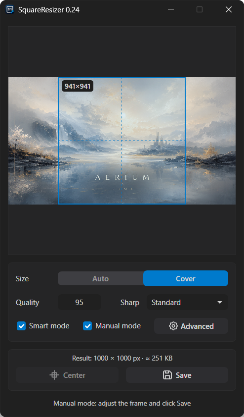
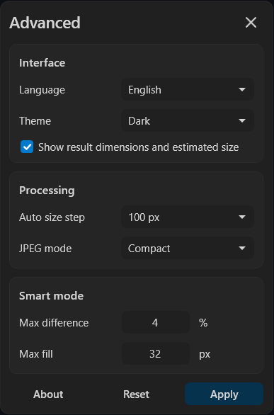

# SquareResizer

SquareResizer – компактная portable-утилита для Windows, которая превращает изображения в квадратные JPG-файлы без искажения пропорций. Программа подходит для музыкальных обложек и другой быстрой пакетной обработки.

## Скриншоты

### Главное окно (ручной режим)

### Страница «Дополнительно»

## Возможности

- Обычная обработка одного или нескольких изображений
- Безопасная квадратная обрезка без растягивания
- Ручной режим с предпросмотром, изменяемой crop-рамкой и поворотом изображения
- Умная дорисовка короткой стороны цветом фона
- Размер результата по исходнику или по стандарту обложки
- Настройка качества JPG, JPEG-режима и резкости
- Улучшение совместимости с онлайн-сервисами через очистку метаданных и преобразование в sRGB
- Светлая и тёмная темы, русский и английский интерфейс
- Сохранение рядом с исходником с добавлением итогового размера к имени
- Интеграция с меню Windows «Отправить» и контекстным меню

## Использование

1. Выберите режим размера: «Авто» или «Обложка»
2. Настройте качество, резкость, умный и ручной режимы
3. Откройте файл кнопкой или перетащите изображение в окно
4. В обычном режиме результат сохранится автоматически
5. В ручном режиме настройте рамку, при необходимости поверните изображение и нажмите «Сохранить»

## Режимы обработки

**Авто** округляет квадратный результат вниз по выбранному шагу и не увеличивает изображение

**Обложка** выбирает ближайший стандартный размер: 1400, 1200, 1000, 700, 600 или 500 px

**Умный режим** дорисовывает фон, если разница сторон укладывается в заданные ограничения. В остальных случаях используется квадратная обрезка по короткой стороне

**Ручной режим** позволяет перемещать и изменять квадратную рамку и поворачивать изображение на 90° по часовой стрелке. `Alt` изменяет рамку симметрично, стрелки двигают её на 1 px, `Shift + стрелки` – на 10 px, `Ctrl + Home` центрирует, `Ctrl + S` сохраняет, `Esc` закрывает изображение

## Настройки

На странице «Дополнительно» находятся язык, тема, шаг авторазмера, JPEG-режим, улучшение совместимости с онлайн-сервисами, ограничения умной дорисовки и управление интеграцией с Windows. Главное содержимое, «Дополнительно», «О программе» и лицензии открываются последовательно внутри одного окна. Настройки сохраняются в `settings.txt` рядом с программой; файл создаётся автоматически при первом запуске

Включённое по умолчанию улучшение совместимости преобразует результат в sRGB и удаляет EXIF, XMP, комментарии, цветовые профили и другие необязательные данные

В ручном режиме всегда отображаются размер результата и примерный вес JPG

## Результат

Поддерживаемые входные форматы: JPG, JPEG, PNG, WEBP, BMP, TIF, TIFF

Результат всегда сохраняется в JPG рядом с исходником. Например, `cover.png` превращается в `cover_1000x1000.jpg`. При совпадении имени добавляется номер

Прозрачные области заменяются белым фоном

## Интеграция с Windows

Интеграция с Windows настраивается прямо на странице «Дополнительно». Доступны три варианта:

- обычная обработка в контекстном меню
- открытие сразу в ручном режиме из контекстного меню
- ярлык SquareResizer в меню «Отправить»

При открытии страницы программа считывает фактическое состояние каждой интеграции из Windows. Отметьте нужные варианты и нажмите «Применить», чтобы добавить, обновить или удалить их

Русский текст команд используется при русском языке интерфейса Windows. Для остальных языков используется английский вариант

Интеграция настраивается для текущего пользователя и не требует прав администратора

## Системные требования

Windows 11 x64

## Лицензия

MIT
