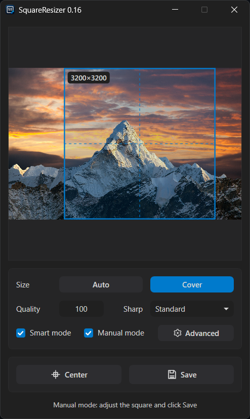
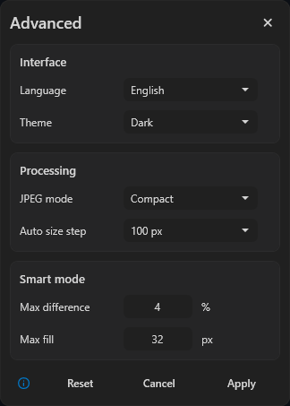

# SquareResizer

SquareResizer is a compact portable utility for Windows, designed for preparing square images. The application opens one or more images, makes them square, applies the selected size, and saves the resulting JPG files next to the source files.

The main use case is music covers and similar images where you need a quick, clean square result without manual work in a full graphics editor.

## Screenshots

### Main window (manual mode)

### Advanced window

## Features

- Process one or more files in regular mode
- Safe conversion of non-square images without stretching proportions
- Manual mode with preview and a square crop frame
- Move the crop frame with the mouse and keyboard, and resize it from corners and sides
- Close the loaded image in manual mode with Esc or the context menu
- Smart mode for extending the missing side with the background color
- Output size selection: Auto or Cover
- Configurable rounding step for Auto
- Standard cover sizes: 1400x1400, 1200x1200, 1000x1000, 700x700, 600x600, 500x500
- JPG quality setting
- JPEG mode setting
- Optional sharpening after resizing
- Light and dark theme switching
- Interface language switching
- Save the result next to the source file
- Automatically add the output size suffix to the file name
- Fast image processing through the Windows SendTo menu
- Separate scripts for the regular context menu item and opening an image directly in manual mode

## How to use

1. Start SquareResizer
2. Select the size: Auto or Cover
3. In the main window, configure quality, sharpness, smart mode and manual mode
4. If needed, open Advanced and configure language, theme, JPEG mode, Auto size step and smart mode limits
5. Open an image with the Select file button or drag it into the application window
6. In regular mode, the application immediately saves the resulting square JPG file next to the source file
7. In manual mode, adjust the crop frame and click Save

## Size modes

Auto\
The application creates a square based on the source image size and rounds the final size using the selected Auto size step. The default step is 100 px.

If smart mode can safely extend the background, the square is created using the larger side. If extension is not possible, the image is first cropped to a square by the shorter side and then resized evenly to the final size.

Cover\
The application converts the image to the nearest standard cover size: 1400x1400, 1200x1200, 1000x1000, 700x700, 600x600 or 500x500. The minimum size in this mode is 500x500.

Non-square images in this mode are not stretched with distorted proportions. If smart mode does not extend the background, the image is first cropped to a square by the shorter side and then resized to the selected standard size.

## Smart mode

Smart mode extends the short side with background if the side difference fits the limits. This is useful for nearly square images with plain edges, for example covers with a disc or circle on a white, black or other flat background.

The extension is limited by two settings:

- Max difference, % – checks the side difference relative to the larger side
- Max fill, px – limits how many pixels can be added as background

Both conditions are applied at the same time. If the background cannot be detected or at least one limit is exceeded, the application does not extend the image. In this case, safe square cropping by the shorter side is used without stretching proportions.

## Manual mode

Manual mode is intended for images where automatic processing may damage important details near the edge or where you need to manually select an exact square fragment. In this mode, the image opens in preview and a square crop frame appears on top of it.

The crop frame can be moved as a whole or resized from corners and sides. When resizing from a corner, the opposite corner stays in place. When resizing from a side, the opposite side stays in place. The frame always remains square.

Crop frame controls:

- Drag inside the frame – move the frame
- Drag a corner or side – resize the frame
- Shift while dragging – more precise movement
- Ctrl while dragging – faster movement
- Arrow keys – move the frame by 1 pixel
- Shift + arrow keys – move the frame by 10 pixels
- Ctrl + S – save
- Ctrl + Home – center the frame
- Esc – close the loaded image

The loaded image can also be closed through the Close file context menu item.

After clicking Save, the application takes the selected square, applies the selected size and saves the result next to the source file. The image stays open, and the Save button becomes inactive until the next result change.

If an image is opened directly in manual mode through the Windows context menu and multiple files are selected, the application opens the first supported file and skips the rest.

## Sharpness

Sharpness is applied only after resizing.

Available modes:

- Standard
- Increased
- High
- Maximum

Stronger sharpening can emphasize details, but on some images it may increase artifacts.

## Quality

Quality applies to the output JPG file. Allowed value: 1 to 100. The value can be changed in the main window.

## JPEG mode

JPEG mode controls the compression level of the output JPG file. It does not replace JPG quality and works together with it.

Available modes:

- Compact – reduces file size at the cost of some quality loss
- Balanced – intermediate option
- Maximum – preserves quality, but increases file size

## Advanced settings

The Advanced window contains settings that are not needed for every operation:

- Interface language
- Theme
- JPEG mode
- Auto size step
- Max difference, %
- Max fill, px

Changes are applied after clicking Apply.

## Settings

Settings are stored in settings.txt next to the application. If the file is missing next to the application, it is created from the built-in template. The template is edited in the source files.

Many settings are available through the application interface. Manual changes in settings.txt are applied after restarting the application.

Example settings.txt:\
quality=95\
resize_mode=music_cover\
sharp_mode=standard\
jpeg_mode=1\
smart_mode=true\
manual_mode=false\
smart_padding_percent=4\
smart_padding_max_px=32\
auto_size_step=100\
theme=dark\
language=en

quality\
JPG save quality\
Allowed value: 1 to 100

resize_mode\
auto – Auto mode\
music_cover – Cover mode

sharp_mode\
standard – standard sharpness\
increased – increased sharpness\
high – high sharpness\
maximum – maximum sharpness

jpeg_mode\
1 – compact JPG\
2 – balanced JPG\
3 – maximum JPG

smart_mode\
true – enable smart mode\
false – disable smart mode

manual_mode\
true – enable manual mode\
false – disable manual mode

smart_padding_percent\
Maximum side difference in percent for smart mode\
Allowed value: 0 to 20

smart_padding_max_px\
Maximum number of pixels that smart mode can add as background\
Allowed value: 0 to 300

auto_size_step\
Rounding step for Auto\
Available values: 5, 10, 15, 20, 25, 30, 35, 40, 45, 50, 60, 70, 80, 90, 100, 200

theme\
light – light theme\
dark – dark theme

language\
en – English interface\
ru – Russian interface

## File names

The resulting file is saved next to the source image in JPG format.

The output size suffix is added to the file name, for example:\
cover.png -> cover_1000x1000.jpg

If a file with the same name already exists, the application adds a number:\
cover_1000x1000_2.jpg

If the source JPG/JPEG already has the required square size and does not need processing, no new file is created.

If the source PNG, WEBP, BMP, TIF or TIFF already has the required square size and does not need geometry changes, the application still silently exports it to JPG next to the original.

## Windows Integration

In the built package, integration scripts are located in the windows-integration folder next to SquareResizer.exe.

CreateSendToShortcut\
Creates a SquareResizer shortcut in the Windows SendTo menu

InstallContextMenu\
Adds a custom context menu item for supported images\
InstallManualContextMenu\
Adds a separate context menu item for opening an image directly in manual mode\
Script variants with Russian and English context menu labels are provided.

If PowerShell blocks script execution, run the required script with a command, for example:

powershell -ExecutionPolicy Bypass -File .\windows-integration\CreateSendToShortcut.ps1

The scripts work in the current user profile and do not require administrator rights.

## Supported input formats

The application is designed to work with common image formats:

JPG, JPEG, PNG, WEBP, BMP, TIF, TIFF

## Output format

The result is always saved as JPG. For images with transparency, transparent areas are replaced with a white background because JPG does not support an alpha channel.

## System requirements

Windows 11 x64. Operation on other Windows editions is not guaranteed.

## License

MIT
